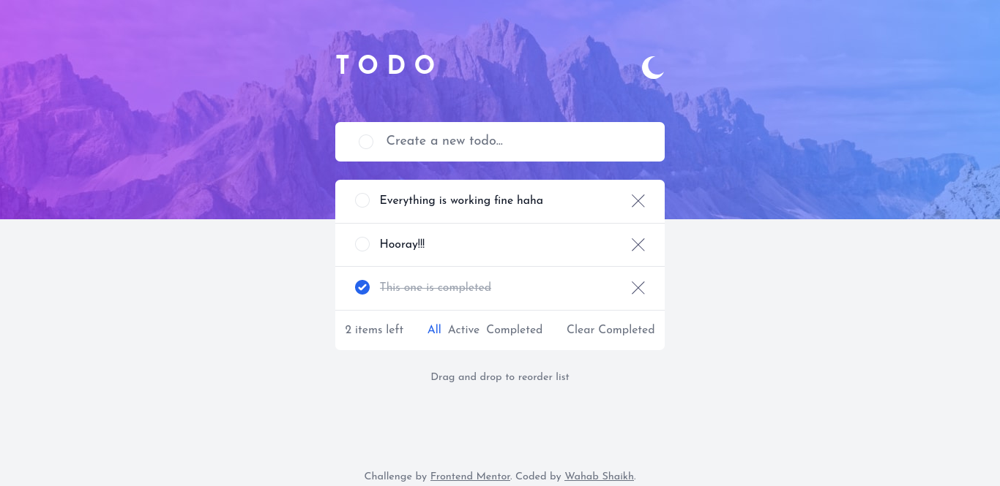
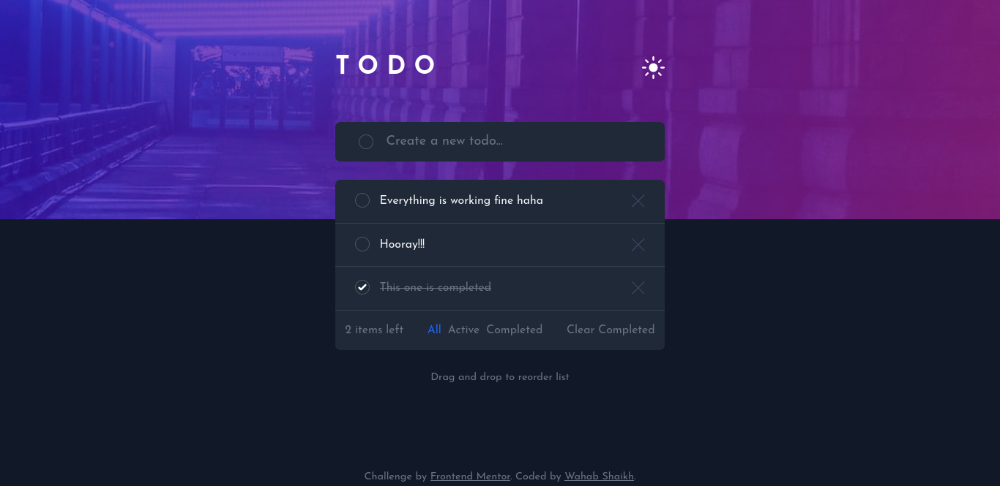

# Frontend Mentor - Todo app solution

This is a solution to the [Todo app challenge on Frontend Mentor](https://www.frontendmentor.io/challenges/todo-app-Su1_KokOW). Frontend Mentor challenges help you improve your coding skills by building realistic projects.

## Table of contents

- [Overview](#overview)
  - [The challenge](#the-challenge)
  - [Screenshot](#screenshot)
  - [Links](#links)
- [My process](#my-process)
  - [Built with](#built-with)
  - [What I learned](#what-i-learned)
  - [Continued development](#continued-development)
  - [Useful resources](#useful-resources)
- [Author](#author)

## Overview

### The challenge

Users should be able to:

- View the optimal layout for the app depending on their device's screen size
- See hover states for all interactive elements on the page
- Add new todos to the list
- Mark todos as complete
- Delete todos from the list
- Filter by all/active/complete todos
- Clear all completed todos
- Toggle light and dark mode
- **Bonus**: Drag and drop to reorder items on the list

### Screenshot

### Links

- Solution URL: [https://github.com/wahabshaikh/todo-app](https://github.com/wahabshaikh/todo-app)
- Live Site URL: [https://todo-app-wahabshaikh.vercel.app](https://todo-app-wahabshaikh.vercel.app)

## My process

### Built with

- [Next.js](https://nextjs.org/)
- [Tailwind CSS](https://tailwindcss.com/)
- [Fauna](https://fauna.com/)
- [Vercel](https://vercel.com/)

### What I learned

Perhaps, the biggest lesson that I learnt is small wins matter! I used to drop working on personal projects if I could not finish it in one go, or if I got stuck somewhere. Basically, the change in mindset helped a lot to complete this one. I tackled one feature at a time (have a look at the commits and you'll understand 😉). Public commitment on Twitter also helped!

On the coding front, this was a good practice to test my React and Tailwind CSS skills. First time, I actually used the drag and drop feature. Practiced the JAMstack architecture.

### Continued development

- Code Refactoring: Spaghetti code all around this project. 😛
- Responsive Design
- Accessibility

### Useful resources

- [Introduction to the JAMStack course on Frontend Masters](https://frontendmasters.com/courses/jamstack/) - The course that helped me with JAMstack architecture.
- [JAMstack Todo App with Gatsby, Netlify Functions and Fauna](https://github.com/jlengstorf/jamstack-intro/tree/final/sections/todos) - The base app this project is inspired from.
- [How to Add Drag and Drop in React with React Beautiful DnD](https://www.freecodecamp.org/news/how-to-add-drag-and-drop-in-react-with-react-beautiful-dnd/) - Helped me implement the Drag and Drop functionality with ease.

## Author

- Website - [Wahab Shaikh](https://wahabshaikh.github.io)
- Frontend Mentor - [@wahabshaikh](https://www.frontendmentor.io/profile/wahabshaikh)
- Twitter - [@wahabshaikh\_](https://www.twitter.com/wahabshaikh_)
